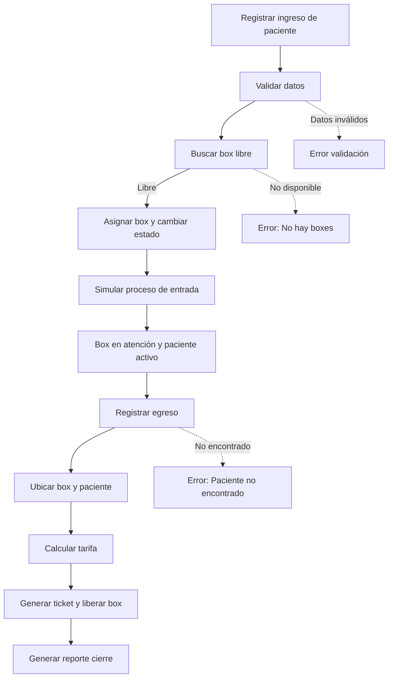

# PetCare

PetCare es un sistema en Kotlin para gestionar la atención en una clínica veterinaria, incluyendo pacientes, boxes, tarifas y reportes con corutinas para simular el flujo de trabajo.

---

## Tabla de Contenidos

- [Descripción General](#descripción-general)
- [Características Principales](#características-principales)
- [Estructura del Proyecto](#estructura-del-proyecto)
- [Modelos de Dominio](#modelos-de-dominio)
- [Servicios y Lógica de Negocio](#servicios-y-lógica-de-negocio)
- [Validación y Cálculo de Tarifas](#validación-y-cálculo-de-tarifas)
- [Configuración y Ejecución](#configuración-y-ejecución)
- [Créditos y Licencia](#créditos-y-licencia)

---

## Descripción General

PetCare gestiona ingreso y egreso de mascotas, asignación de boxes y cobro según reglas de negocio, generando tickets y reportes de cierre para distintos tipos de pacientes y propietarios.

> [!NOTA]
> El sistema está implementado íntegramente en Kotlin sobre JVM y utiliza corutinas para simular procesos internos.

---

## Características Principales

- Registro de ingreso y egreso de pacientes con control de disponibilidad de boxes.
- Validación de datos del paciente y del tipo de propietario.
- Cálculo de tarifas con IVA, descuentos y recargos según reglas definidas.
- Generación de tickets y reporte de cierre de atención.
- Modelos claros para pacientes, dueños, boxes y tickets.

---

## Estructura del Proyecto

La estructura sigue el estándar de proyectos Kotlin con Gradle como herramienta de construcción.

```
PetCare/
│
├── build.gradle.kts
├── gradle.properties
├── settings.gradle.kts
├── gradlew
├── gradle/
│   └── wrapper/
│       └── gradle-wrapper.properties
└── src/
    └── main/
        └── kotlin/
            └── cl/
                └── petcare/
                    ├── Main.kt
                    ├── model/
                    │   ├── Box.kt
                    │   ├── BoxState.kt
                    │   ├── OwnerType.kt
                    │   ├── Patient.kt
                    │   ├── PatientType.kt
                    │   └── Ticket.kt
                    └── service/
                        ├── PatientValidator.kt
                        ├── PetCareSystem.kt
                        └── TariffCalculator.kt
```

- Archivos de Gradle: configuración del proyecto, dependencias y versión de Java.
- `src/main/kotlin/cl/petcare/model/`: modelos de dominio.
- `src/main/kotlin/cl/petcare/service/`: servicios y lógica de negocio.

---

## Modelos de Dominio

Los modelos del paquete `src/main/kotlin/cl/petcare/model/` representan las entidades centrales usadas para registrar pacientes, asignar boxes y emitir tickets.

<details><summary>Resumen de modelos</summary>

```card
{
  "title": "Patient",
  "content": "Representa una mascota atendida, con código, nombre, especie, tipo, dueño y fecha de ingreso.",
  "type": "class",
  "filePath": "src/main/kotlin/cl/petcare/model/Patient.kt",
  "badges": ["public"]
}
```

```card
{
  "title": "Box",
  "content": "Modela un box de atención, su número, estado, código de paciente y motivo asociado.",
  "type": "class",
  "filePath": "src/main/kotlin/cl/petcare/model/Box.kt",
  "badges": ["public"]
}
```

```card
{
  "title": "BoxState",
  "content": "Enumera los estados de un box: LIBRE, EN_ATENCION, EN_PROCESO, FUERA_DE_SERVICIO.",
  "type": "enum",
  "filePath": "src/main/kotlin/cl/petcare/model/BoxState.kt",
  "badges": ["public", "read-only"]
}
```

```card
{
  "title": "OwnerType",
  "content": "Enumera los tipos de propietario: PARTICULAR, CONVENIO y MUNICIPAL.",
  "type": "enum",
  "filePath": "src/main/kotlin/cl/petcare/model/OwnerType.kt",
  "badges": ["public", "read-only"]
}
```

```card
{
  "title": "PatientType",
  "content": "Enumera el tipo de paciente: CANINO, FELINO, EXOTICO, con su tarifa base por hora.",
  "type": "enum",
  "filePath": "src/main/kotlin/cl/petcare/model/PatientType.kt",
  "badges": ["public", "read-only"]
}
```

```card
{
  "title": "Ticket",
  "content": "Representa el comprobante de atención: número, paciente, minutos y monto pagado.",
  "type": "class",
  "filePath": "src/main/kotlin/cl/petcare/model/Ticket.kt",
  "badges": ["public"]
}
```

</details>

---

## Servicios y Lógica de Negocio

La clase `PetCareSystem` (`src/main/kotlin/cl/petcare/service/PetCareSystem.kt`) coordina boxes, pacientes activos y tickets, gestionando el ciclo completo de atención desde el ingreso validado hasta el egreso con cálculo de tarifa y generación de comprobante.

Las operaciones clave incluyen:

- Búsqueda y asignación de boxes libres usando `BoxState`.
- Uso de `PatientValidator` para validar cada ingreso.
- Integración con `TariffCalculator` para determinar el monto a pagar.
- Manejo de errores y generación de reporte de cierre mediante salidas por consola.

<details>
<summary>Flujo de atención del sistema</summary>



</details>

---

## Validación y Cálculo de Tarifas

### Validación de Pacientes

`PatientValidator` (`src/main/kotlin/cl/petcare/service/PatientValidator.kt`) centraliza las reglas de validación y verifica formato del código, nombre, especie y tipo de dueño, lanzando errores en caso de datos inválidos.

- Código con formato `AA00AA`, mayúsculas y dígitos.
- Nombre y especie no vacíos.
- Tipo de dueño presente en `OwnerType`.

> [!IMPORTANTE]
> Si la validación falla, se cancela el registro y se informa el mensaje de error.

### Cálculo de Tarifas

`TariffCalculator` (`src/main/kotlin/cl/petcare/service/TariffCalculator.kt`) calcula el monto usando tipo de paciente, minutos de uso y tipo de dueño, aplicando IVA, descuentos y recargos definidos en constantes.

- Caninos: tarifa base por hora, con descuento por convenio.
- Felinos: cobro solo si el tiempo supera 20 minutos.
- Exóticos: recargo adicional si el paciente es silvestre.
- Dueños municipales: descuento sobre el valor con IVA.

---

## Configuración y Ejecución

El proyecto usa Gradle con Kotlin JVM 1.9.25 y Java 21, con clase principal `cl.petcare.MainKt` configurada en `build.gradle.kts`.

- `build.gradle.kts`: plugins, dependencias y configuración de compilación.
- `gradle.properties`: estrategia de compilación del compilador Kotlin.
- `gradlew`: script para ejecutar tareas de Gradle de forma portable.

```Pasos
1. Clonar el repositorio | Descargar el código fuente en tu entorno de desarrollo.
2. Configurar entorno JVM | Verificar que tienes Java 21 instalado.
3. Ejecutar por Gradle | Usar `./gradlew run` para iniciar la aplicación principal.
```

> [!TIP]
> El proyecto declara todas las dependencias necesarias en `build.gradle.kts`.

### Uso del sistema

PetCare se ejecuta desde `src/main/kotlin/cl/petcare/Main.kt`. Al iniciarse crea un `PetCareSystem` y registra varios pacientes de ejemplo. Luego procesa sus ingresos y egresos y finalmente imprime un reporte de cierre en la consola. Para usar el sistema solo debes ejecutar la aplicación y revisar los mensajes impresos.

```Pasos
1. Iniciar la aplicación | Ejecutar `./gradlew run` en la raíz del proyecto.
2. Seguir el flujo simulado | Observar en consola el registro de ingresos y egresos de los pacientes.
3. Revisar el reporte final | Ver el reporte de cierre impreso al finalizar el procesamiento.
```

---

## Créditos y Licencia

PetCare se distribuye bajo licencia Apache, según lo indicado en los encabezados de los archivos y el script de Gradle.

> [!IMPORTANTE]
> Revisa los archivos fuente para detalles específicos de derechos de autor y uso permitido.